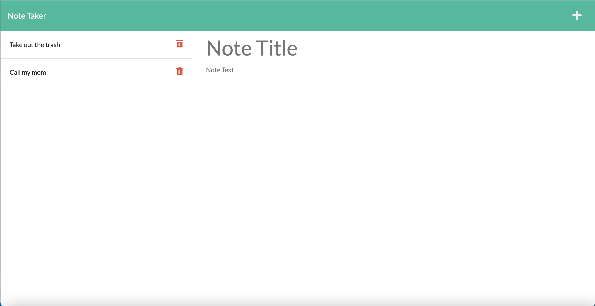

# Note Taker

## Description

This is a note taking app where you can organize your thoughts and keep track of tasks you have to complete. When you go to the URL, it will take you to the landing page. Click the link to get to the notes page. Once on the notes page, you have see your existing notes on the left side. You can enter a new note on the right side, and save them by clicking the save icon on the top-right corner. Make sure to enter a Note Title and Note Text. You can also delete also lists by clicking the trash icon next to each note. 

## Link

https://note-taker-ehochw01.herokuapp.com/

## Screenshot

